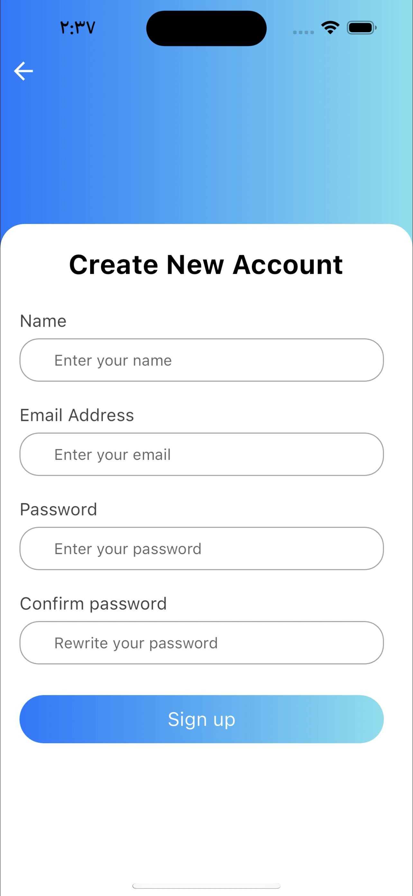
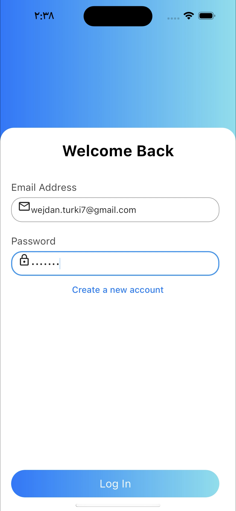
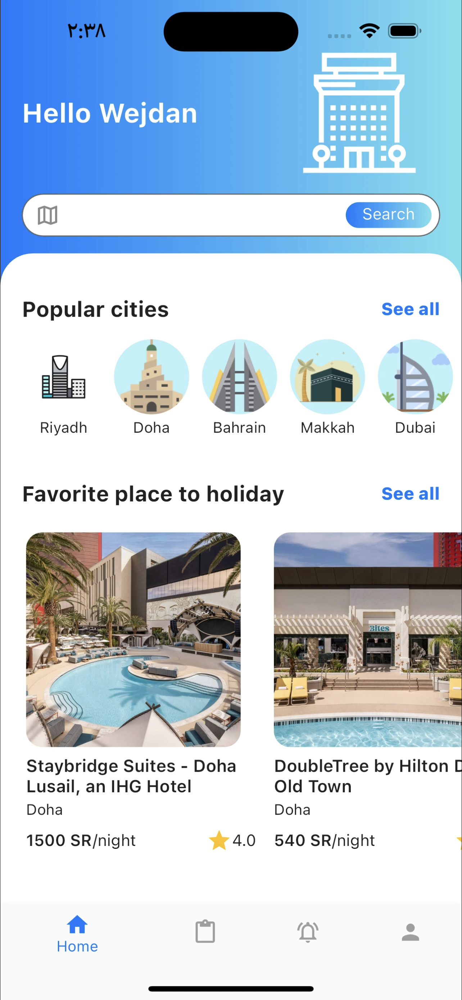
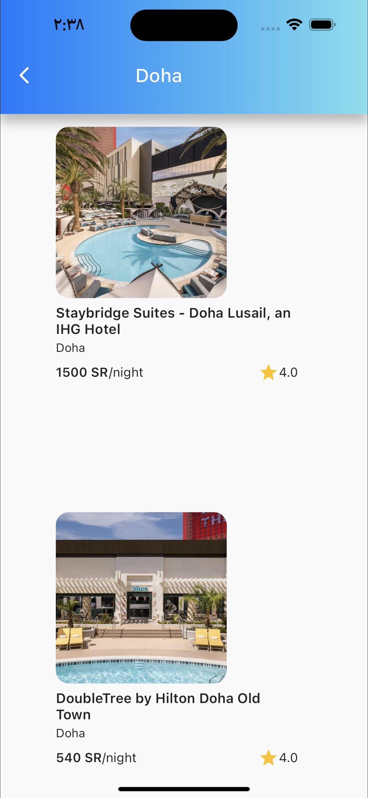
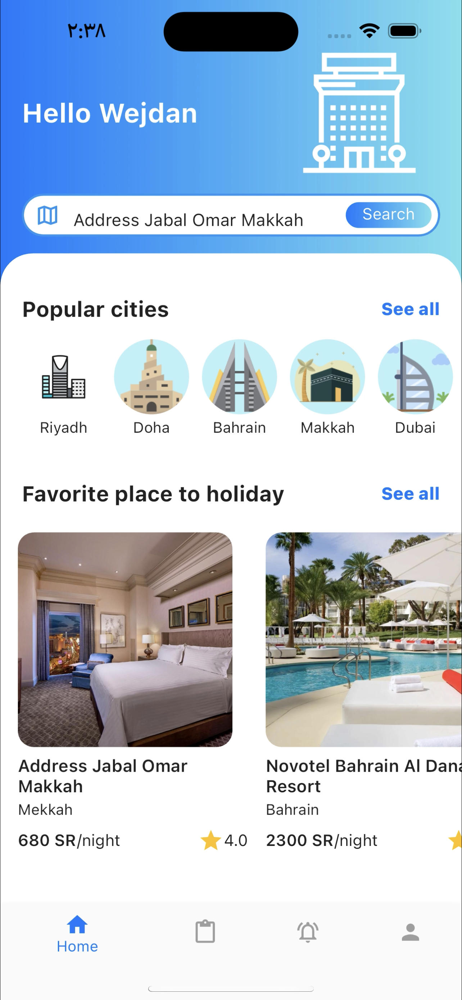
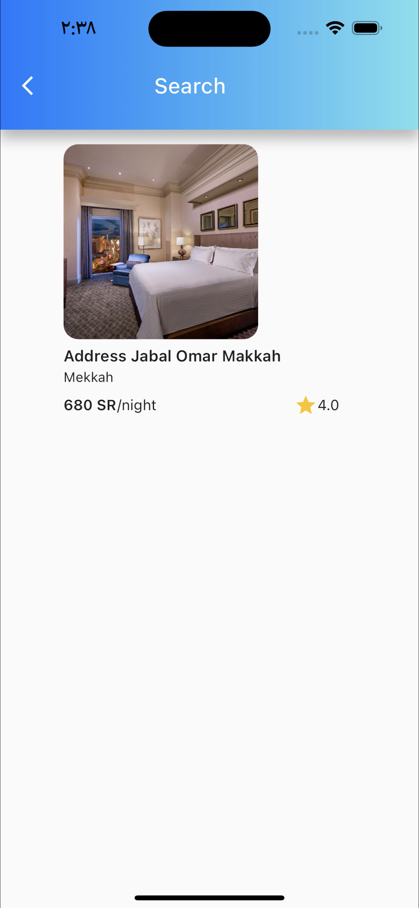
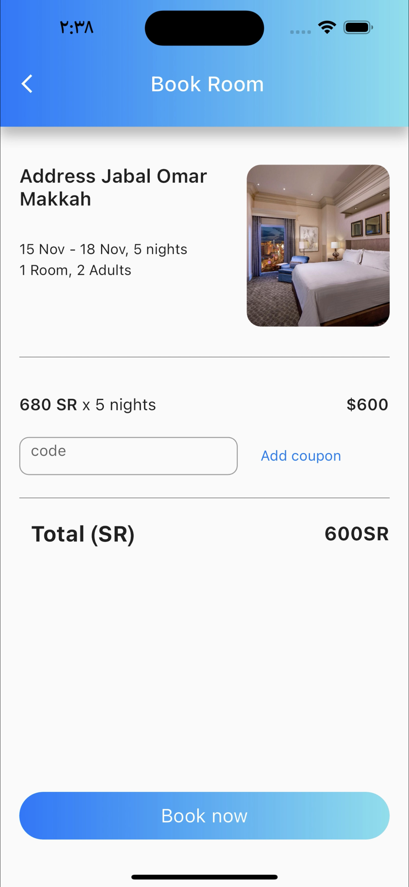

# WM-Hotel 

A new Flutter project is a management reservation hotel app.

## App Screens:

### This is the Signup screen 

### This is a login screen 

### This is HomeScreen 
- On this page, you can: view all hotels.

### Sort hotel by city
-Here we see Doha hotels.\

### Search in hotel by name

### Details RoomScreen

- On this page, you can: view all item details and book a hotel room.

### Thanks for scrolling=)
